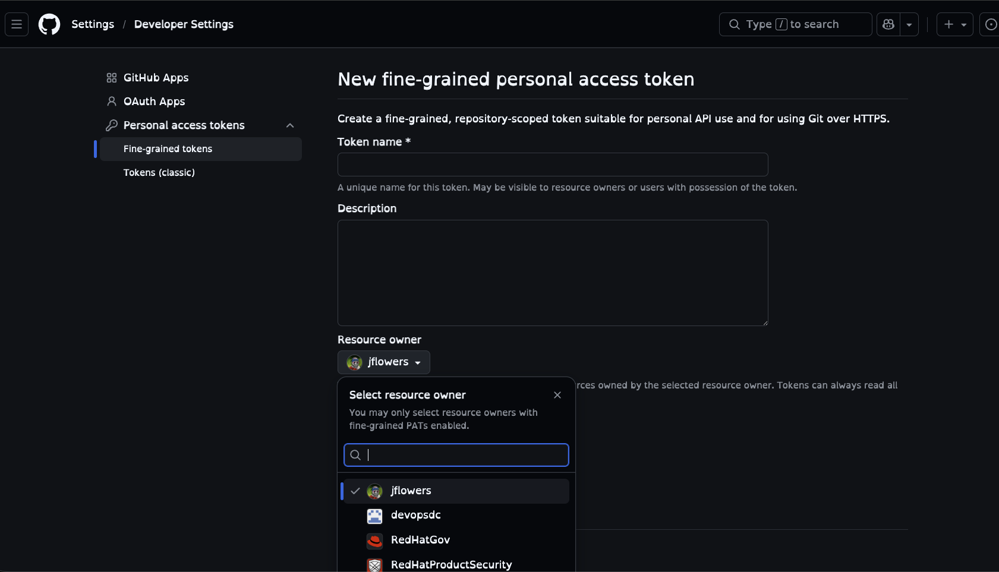

# GitHub MCP Server

This guide explains how to set up the GitHub MCP server and create the necessary authentication tokens.

## Configuration

To configure the GitHub MCP server in your client settings (e.g., Gemini, Claude):

```json
"github": {
  "httpUrl": "https://api.githubcopilot.com/mcp/",
  "headers": {
    "Authorization": "Bearer your_token_here"
  }
}
```

## Prerequisites

1.  **Personal Access Token (PAT):** You must create a fine-grained token for the **complytime** organization as detailed below. This token will be used in your configuration headers.

---

## Creating a Fine-Grained Token

This section describes the process for creating and getting approval for a fine-grained personal access token (PAT) for the **complytime** organization.

### Steps to Create

1.  **Navigate to Developer Settings:**
    Go to your GitHub [Settings](https://github.com/settings/profile), then scroll down to the bottom of the left sidebar and click on **Developer settings**.

2.  **Access Fine-grained Tokens:**
    Expand **Personal access tokens** in the left sidebar and select **Fine-grained tokens**.

3.  **Generate New Token:**
    Click the **Generate new token** button.

4.  **Configure Token Details:**
    -   **Token name:** Give your token a descriptive name (e.g., `org-ai-access`).
    -   **Expiration:** Set an appropriate expiration period.
    -   **Description:** (Optional) Provide context for what this token will be used for.

5.  **Select Resource Owner:**
    Under **Resource owner**, select **complytime** from the dropdown menu. This ensures the token is scoped to the organization.

    

6.  **Repository Access:**
    Choose whether the token should have access to **All repositories** within the organization or **Only select repositories**. For most use cases, selecting specific repositories is recommended for security.

7.  **Set Permissions (Scopes):**
    Configure the necessary permissions. For the MCP server, you typically need:
    -   **Contents:** Read and write
    -   **Metadata:** Read-only (mandatory)
    -   **Pull requests:** Read and write
    -   **Issues:** Read and write

8.  **Generate Token:**
    Scroll to the bottom and click **Generate token**.

### Approval Process

Once you generate the token, if the **complytime** organization requires administrator approval for fine-grained PATs, the following will happen:

1.  **Pending Status:** The token will be created but will remain in a **Pending** state.
2.  **Notification:** Organization owners will receive a notification of the request.
3.  **Review:** An administrator will review the requested permissions and either approve or deny the request.
4.  **Activation:** Once approved, you will receive an email notification, and the token will become active and ready for use.

> [!IMPORTANT]
> Make sure to copy your token immediately after it is generated (or after it is approved and becomes available). You will not be able to see it again.
